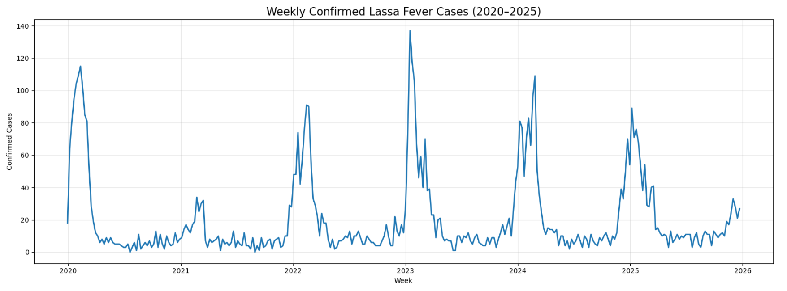
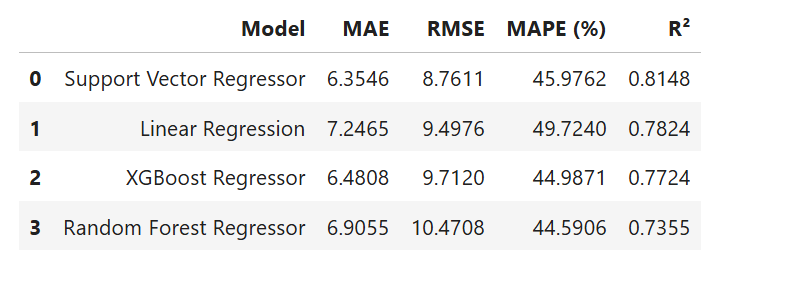
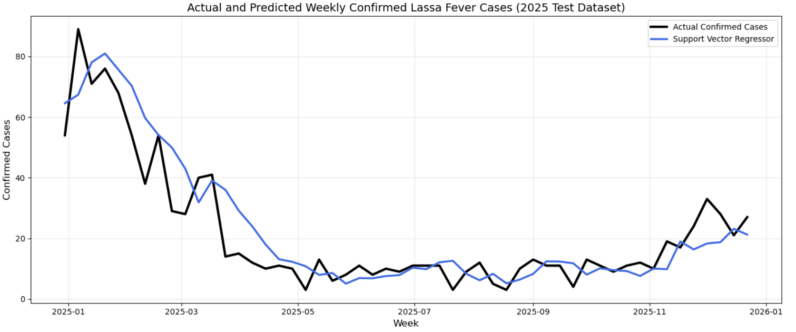
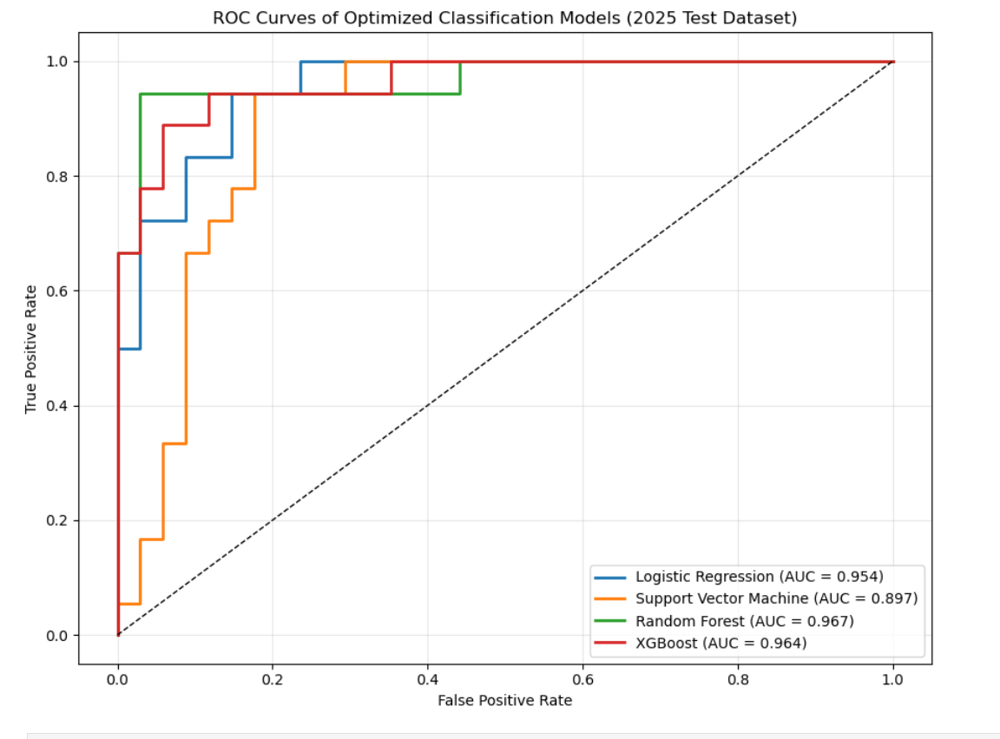

# Lassa Fever Machine Learning Forecasting

A leakage-aware machine learning framework for forecasting weekly Lassa fever cases and classifying outbreak activity using temporal surveillance data.

## Project Overview

This project applies machine learning to weekly Lassa fever surveillance data to forecast confirmed cases and classify outbreak activity.

The workflow includes data preprocessing, exploratory analysis, temporal feature engineering, leakage prevention, regression modelling, classification modelling, hyperparameter optimization, and independent-year evaluation.

## Objectives

- Analyse temporal patterns in weekly Lassa fever surveillance data
- Engineer lag-based and rolling temporal features
- Develop regression models for weekly case forecasting
- Develop classification models for outbreak prediction
- Evaluate model performance using an independent 2025 test period

## Machine Learning Workflow

Data Loading → Data Cleaning → Exploratory Data Analysis → Temporal Feature Engineering → Leakage Validation → Chronological Split → Model Training → Hyperparameter Optimization → Independent Test Evaluation

## Validation Strategy

The dataset was divided chronologically to preserve temporal integrity:

- Training: historical observations up to 2023
- Validation: 2024
- Independent Test: 2025

This approach reduces temporal information leakage and provides a more realistic assessment of model performance.

## Regression Models

- Linear Regression
- Random Forest Regressor
- Support Vector Regressor
- XGBoost Regressor

## Classification Models

- Logistic Regression
- Random Forest Classifier
- Support Vector Machine
- XGBoost Classifier

## Key Results

The optimized Support Vector Regressor achieved the strongest overall forecasting performance on the independent 2025 test data.

The XGBoost classifier achieved strong outbreak classification performance on the independent 2025 test period.

Detailed evaluation outputs are available in the `results` folder.

## Visualizations

### Weekly Confirmed Cases



### Regression Model Comparison



### Actual vs Predicted Cases



### ROC Curve



## Repository Contents

- [Jupyter Notebook](notebooks/Lassa_Fever_Machine_Learning_Dev.ipynb)
- [Dataset](data/lassa_fever.csv)
- [Model Evaluation Results](results/)
- [Project Visualizations](images/)
- [Python Requirements](requirements.txt)

## How to Run the Project

1. Clone the repository:

```bash
git clone https://github.com/paul-shir/lassa-fever-machine-learning-forecasting.git
```

2. Navigate to the project directory:

```bash
cd lassa-fever-machine-learning-forecasting
```

3. Install the required packages:

```bash
pip install -r requirements.txt
```

4. Launch Jupyter Notebook:

```bash
jupyter notebook
```

5. Open:

```text
notebooks/Lassa_Fever_Machine_Learning_Dev.ipynb
```
## Repository Structure

```text
lassa-fever-machine-learning-forecasting/
├── data/
├── images/
├── notebooks/
├── results/
├── .gitignore
└── README.md
